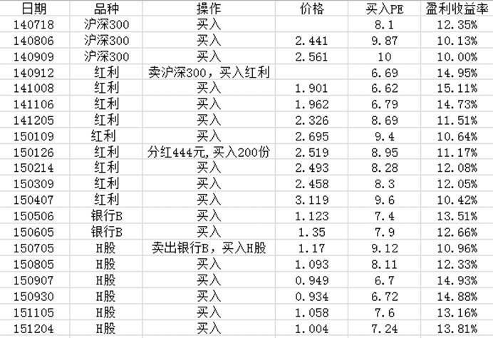

## 第八章 构建属于自己的定投计划
一份完整的定投计划，需要根据自己的收入和开支，构建合理的每月定投额度；需要筛选适合投资的品种；需要设定好买卖区间。最终我们需要把这些落在纸面上，让任何一个拿到这个计划的人，都可以执行出相同的效果，那么，这份定投计划就算完成了。

需要强调的是，最终的计划必须能落在纸面上！这样才能让自己每次投资的时候严格遵守，避免主观情绪干扰我们的投资。

### 8.1 第一步：梳理自己的需求
**投资是有目的的。**现实生活中没有哪个商家会收股票来卖东西，所以我们**最终还是会把股票卖出**，拿到现金去消费或是做别的事情。

**只有这笔钱在未来10年以上的时间里，都不会被迫拿来使用，我们才可以把这笔钱用于投资股票基金。**

### 8.2 第二步：梳理自己的现金流
“巧妇难为无米之炊”，没有钱可投资不了基金。在投资之前，我们要梳理一下自己的**现金流来源**，看看自己有多少资金进账，会花掉多少钱，这样才能更好地规划定投。

日常的开销可以用第一章的知识梳理一下，看看有哪些不必要的支出可以减少：例如抽烟喝酒的支出可以控制一下，像买书学习锻炼身体等方面的支出可以不变。额度较高的不必要消费可以为你节省下不小的现金流。

### 8.3 第三步：找到当下适合投资的基金
以2015年11月30日收盘后的数据为例：

如果没有特殊要求，我们可以选H股指数；如果不想承担更高的股价波动，可以选择盈利更稳定的恒生指数；如果想未来依靠基金的分红来更好的生活，那么每年都会分红的红利指数是更好的选择。

### 8.4 第四步：构建自己的定投计划

同时，如果基金短期里下跌，我们可以根据估值提升当月买入的金额，这样可以在更便宜的时候买入更多的基金。

结合下面这个公式：

### 8.5 第五步：将定投计划落在纸面上，坚定不移地执行

接下来我们要做的，就是将这份定投计划落在纸面上，坚定不移地执行。ca

### 8.6 第六步：做好定投记录，方便监督管理

同时，我们还要做好定投记录，方便日后进行复盘，监督检查自己是否正确地执行了计划。
这里贴一个我过去一年半的定投记录，给大家一个参考。

记录下自己买入的日期、品种、操作、价格，对应的市盈率和盈利收益率估值，方便以后查看。

## 第九章 三个定投实例
三个计划都以1000元作为初始投资资金，大家可以根据自己的实际收入，选择不影响正常生活的金额作为起投金额。

### 9.1为父母构建养老定投计划
养老定投计划，需要有很长一段时间“只进不出”，等积累的资产足够多了，每年收益足以覆盖所需要的资金之后，再取用资金，才不会影响未来收益继续增长。

这个定投计划是我从2014年7月18日开始的，到目前仍然在执行中。希望到父母退休之后，每年可以从中提取1万元以上。从现在到8年之后，估计总投入的资金量在15万。按照上面的盈利收益率策略执行，我们可以获取15%—20%以上的年复合收益率。这样到2022年，手里的资产在26万左右。因此，从2022年开始，每年提取至少一万用于父母改善生活，是完全可行的。而同时，剩下的资产还可以继续保持15%—20%以上的增长速度。

### 9.2 为自己构建加薪定投计划
对于大多数上班族来说，薪水的增长速度一般会大幅高于投资的收益率。刚工作不久的年轻人，努力工作几年，薪水增加两三倍一点都不难。但是想几年里靠投资让资产增长两三倍，没有人能保证做到。**所以年轻人最主要的是努力拼搏，无论是上班工作还是努力创业，靠事业提升收入是最关键的。**

与此同时，打理好自己手里的结余资产，也是十分重要的。特别是到了三十多岁，准备养育子女赡养老人的时候，面临的开支会陡然增加。

### 9.3 为子女构建教育定投计划

教育用的资金具有很强的可预见性：自己的孩子将在多少年之后上小学、初中、高中、大学，什么时候用钱等时间点，基本都可以确定。

## 第十章 长期投资的心理建设
**方法并不难，核心就是每次都在指数基金处于低估值的时候才定投，在正常估值的时候持有，在高估的时候卖出，如此循环往复。**

但为什么如此简单又有效的策略，并没有风靡全世界呢？为何我们接触的投资，仍然是以概念炒作、暴涨暴跌为主呢？

原因很简单，因为**心理因素**。格雷厄姆的策略虽然简单，但是对人的心理素质要求较高。**很多时候需要我们摒弃内心的心理干扰，像一个机器人一样去一丝不苟地执行计划。**这一点很少有人能做到，这也是为什么我们需要将计划一一列出，落实在纸面上，这样才能保证自己不会被主观情绪干扰。

在我执行定投计划的这一年半里，我感觉自己非常幸运，既遇到了暴涨，也遇到了罕见的融资盘崩盘导致的暴跌，甚至单日指数基金涨停和跌停也经历了几次。这对我的心理也是非常大的考验。

### 10.1 为何要止盈止损？
在我接触格雷厄姆的策略之前，我也看过一些指数基金的投资书籍。在这些书籍中，我最不能理解的是止盈和止损。

止盈和止损的字面意思很好理解，就是当自己投资的股票，上涨了百分之多少或下跌了百分之多少时，就卖出股票，锁定盈利或损失。**但是这合理吗？为何我盈利了一部分就要卖出？指数未来是涨是跌，与我在什么价位买的有关系吗？**

同样，指数基金如果在低估值的基础上继续下跌，我们应该高兴才对，这样我们在下一次定投的时候就能买入更多的份额了，为何要止损呢？

**指数基金的长期上涨肯定有其他的内在因素驱动，这个因素与我们买入的价格没有任何关系。**依据买入价格来止损止盈并没有什么依据。**那么决定指数基金长期上涨的因素是什么呢？我们从指数基金赚到的钱，来自哪里呢？**

低估值投资指数基金，收益来自两部分，一个是低买高卖的**估值差**，另一个是在持有的这段时间里的**盈利增长**。短期里的收益主要是估值差带来的，长期收益主要是盈利增长带来的。

考虑蓝筹类指数的成长性一般，未来10年平均成长率可以达到8%—10%。如果经济景气，可能会达到平均10%以上；如果经济不景气，在7%—8%。为了全面奔小康，**国家对GDP的增长要求是7%左右，蓝筹指数成长性大概率是比这个要高的**。我们在低估值的时候定投指数，平均持仓成本大约能摊平到8倍PE。未来可能会在15—17PE以上卖出。

成长率取7%，如果3年以内达成条件，年复合收益率就是35%左右。5年以内达成卖出条件，年复合收益率就是24%左右。10年内达成条件，年复合收益率就是16%左右。**按照过去牛熊市的平均周期计算，是5—7年完成一次熊牛转换。所以大概率收益会落在20%—25%之间。**

这就是我们在低估值投资指数基金的大致**收益来源**与**区间**了。明白了这一点，我们就不会用价格来判断是否要卖出了。

### 10.2 拥抱下跌

心理学里有一个非常著名的实验：损失厌恶。
从这个角度，我们能更好地理解在投资股票时的一些现象：例如有的散户想用钱的时候，会先卖掉已经盈利的股票，而留着仍在亏损的股票。这就是典型的损失厌恶。

当指数基金下跌的时候，正是指数基金的盈利收益率上涨的时候。从盈利收益率的角度，指数基金下跌得越多，盈利收益率上涨得就越多。我们可以用更低的价格，买到盈利收益率更高的指数基金，未来的长期收益会更好，认识到了这一点，我们就不会再讨厌下跌了。

### 10.3 《最倒霉的定投者》

1929年6月，一个新闻记者采访了当时通用汽车公司的高级财务总监拉斯科布。拉斯科布讲了一个比较大胆的观点:人人都能发财。在访谈里，拉斯科布说投资者只需要每个月将15美元投入到绩优普通股，在未来的20年里，投资者的财富有望稳步增长至8万美元。

在20年代的牛市狂热氛围中，几乎没有人怀疑这种言论。

但是在拉斯科布发表观点7周之后，美股股市崩盘。34个月之后，道琼斯指数只剩下41点，大盘股的市值蒸发了89%，数百万投资者的毕生积蓄化为乌有，成千上万的融资客最终破产。美国经济进入历史上最严重的萧条期。

拉斯科布可谓是最倒霉的定投投资者了。**但即使像拉斯科布这样倒霉，在估值最高点开始，经历了有史以来最严重的崩盘，定投都可以帮助投资者取得不错的收益。**

如果他能看一下估值，在股市的估值低点开始定投，既可以做到短期不会有大幅下跌，长期来看也将会有一个更加惊人的投资业绩。

而这，正是我们现在正在做的。

