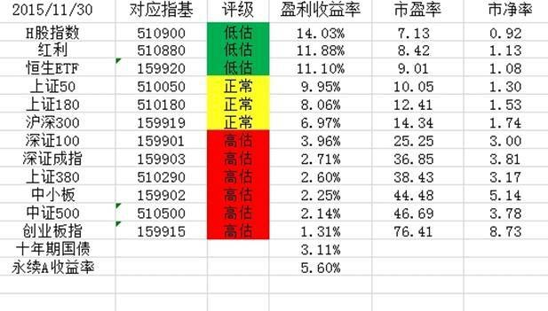

## 第八章 构建属于自己的定投计划
一份完整的定投计划，需要根据自己的收入和开支，构建合理的每月定投额度；需要筛选适合投资的品种；需要设定好买卖区间。最终我们需要把这些落在纸面上，让任何一个拿到这个计划的人，都可以执行出相同的效果，那么，这份定投计划就算完成了。

需要强调的是，最终的计划必须能落在纸面上！这样才能让自己每次投资的时候严格遵守，避免主观情绪干扰我们的投资。

### 8.1 第一步：梳理自己的需求
**投资是有目的的。**现实生活中没有哪个商家会收股票来卖东西，所以我们**最终还是会把股票卖出**，拿到现金去消费或是做别的事情。

**只有这笔钱在未来10年以上的时间里，都不会被迫拿来使用，我们才可以把这笔钱用于投资股票基金。**

### 8.2 第二步：梳理自己的现金流
“巧妇难为无米之炊”，没有钱可投资不了基金。在投资之前，我们要梳理一下自己的**现金流来源**，看看自己有多少资金进账，会花掉多少钱，这样才能更好地规划定投。

日常的开销可以用第一章的知识梳理一下，看看有哪些不必要的支出可以减少：例如抽烟喝酒的支出可以控制一下，像买书学习锻炼身体等方面的支出可以不变。额度较高的不必要消费可以为你节省下不小的现金流。

### 8.3 第三步：找到当下适合投资的基金
以2015年11月30日收盘后的数据为例：

如果没有特殊要求，我们可以选H股指数；如果不想承担更高的股价波动，可以选择盈利更稳定的恒生指数；如果想未来依靠基金的分红来更好的生活，那么每年都会分红的红利指数是更好的选择。

### 8.4 第四步：构建自己的定投计划

同时，如果基金短期里下跌，我们可以根据估值提升当月买入的金额，这样可以在更便宜的时候买入更多的基金。

结合下面这个公式：

### 8.5 第五步：将定投计划落在纸面上，坚定不移地执行

接下来我们要做的，就是将这份定投计划落在纸面上，坚定不移地执行。

### 8.6 第六步：做好定投记录，方便监督管理

同时，我们还要做好定投记录，方便日后进行复盘，监督检查自己是否正确地执行了计划。
这里贴一个我过去一年半的定投记录，给大家一个参考。

记录下自己买入的日期、品种、操作、价格，对应的市盈率和盈利收益率估值，方便以后查看。

## 第九章 三个定投实例
三个计划都以1000元作为初始投资资金，大家可以根据自己的实际收入，选择不影响正常生活的金额作为起投金额。

### 9.1为父母构建养老定投计划

