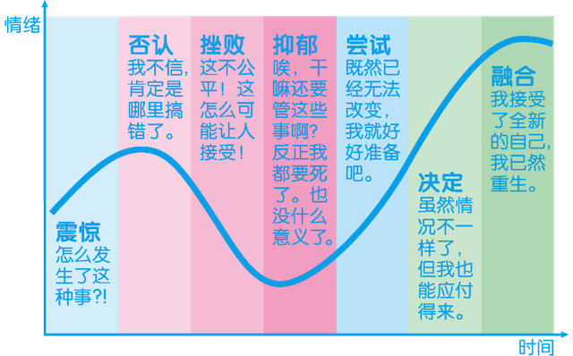

# ETF相关概念
## 年轻人理财入门
过去非要国际投行才能做的事情，我们现在也能做，实现**投资机会公平**。

### 1.1树立正确的理财观

#### 有钱才理财？

**理财误区一：开始太迟**
觉得自己平时没钱，省不了多少，一年那点回报也不值得。
觉得风险太大实在是不想涉足，都投余额宝了。
**应该早一点开始才好**

**理财误区二：步调太猛，把理财当“发财”**
看到过去15年的股市，当时都不敢投，现在一下子投进去太猛。
**理财亏钱的原因**只有一个：把理财当发财。
**发财**是快速地挣钱。
通过现在的财富想离谱地创造财富，太夸张。

**正确的理财：个人财富增值的“助推器”**。
以合适的工具，构筑收益和风险平衡，有限消耗个人成本的理财体系，同时保障现金流的顺畅。**助推器**不是发动机，不要花太多时间发在理财上面，主要内容还是要放在自己的事业上去。**现金流**保障好是不能影响自己的生活的，不能说房租什么的没有了。

**财务自由之路：事业是主基调，理财是助推器**
开公司创业、跳槽、当高管总是可以挣到非常多的钱。
树立合理的收益目标，10%是7年才翻一倍。

 
### 理财目标怎么定

如何衡定理财的水平？
为什么说，当你一年赚了20%的时候，其实可能“赔了”？上证指数涨了30%，你处心积虑也没有跑赢市场，还不如买指数基金得了。
树立**“相对收益“**的概念，不光看**绝对收益**，还要看与市场相比的相对收益。

**年化收益率**是评价长期收益水平的通常标准。
以穷举法汇报每年的收益率实际上用**累计收益率**没什么感觉，把累计收益率算作收益的均值，即可得到年化收益率。

### 1.2确定正确理财目标

#### 理财目标怎么定
假如，你连续10年、20年的年化收益率达到：

>6%基本合格
>10%不错，资产稳健，晚上加个菜
>15%啊好牛，我的钱你帮我管吧（专业领域也非常棒了）
>20%送你三个字“巴菲特”再送两个“股神”

什么是**复利**？年化19.2%的巴菲特50年累积也就是7589倍，股票年华20.8%是1W5千倍，就算是标普9.7%也有113倍，能达到10%在50年就足够非常好，每年多赚0.1%也很好了。

#### 你对风险的理解可能是错的

风险可以“规避”吗？
**无作为**不是“规避”是**“逃避”**
风险是可以被管理，**管理风险**的核心是“风险”应该与你承受风险的能力匹配！

#### 理财的第一步：现金流管理

**现金流管理**是一个动态过程，特别大额支出，随着使用时间的接近，逐步将其从高风险产品转移到低风险产品。

### 1.3投资品种

**流动性**是可以买卖，可以顺利的买卖。

#### 基金：投资股市不一定要“炒股”

**基金**：“聚沙成塔”，集中投资力量。

**私募基金**（美国称对冲基金，起点50W，对冲两个字与对冲风险无关）

**对冲**：避开单线买卖的风险，同一时间买入一外币做买空，也沽出另一货币做沽空，此时两边银码应该一致。
**单线买卖**：看好就买空，看淡就沽空。

**七亏两平一赚**：亏是指对大盘而言，指数基金就是在两平中，让自己资产跟随大盘增长。

**指数**：大盘指数
**指数基金**：挂钩指数，根据指数覆盖的股票和权重规则，购入股票，完全复制。
**指数定投**：每月或者自设周期，将个人收入中部分节余资金投资于指数基金。这是一种积少成多，同时平摊成本的投资方法，适用于涨跌周期变化明显的股市，尤其是我国A股。

### 2.1ETF介绍

#### ETF，给指数基金添把火

**ETF**：可交易基金。

两个要素：
>**可交易**：基金通常是从基金公司那里在每天结束时候进行赎回或者购买，ETF在此之外将基金份额放到二级市场让投资者之间可以进行交易。
>**指数基金**：指数基金的一切优势都包括。

**金融危机**：实质是流动性危机。

**美股强调选个股，选对特别有乐趣。**

**动态再平衡**：每隔半年或者一年，新投资的钱要调整回去自己的已有比例。
有获得诺奖的论文作为支持，毕竟是统计学文章。

### 2.2债券的介绍&美股分析

**债券**：机构发行的债。
**债券面值**：货币的面值是固定的，债券的面值也是固定的。
**债券利率**：100块为基准，每年返给你2块。

债券与货币的区别在于债券能够交易，**交易价格**与**面值**不一样。

**债券收益率**：是**派送利息**除以**交易价格**。

#### 你应该拥有一个美股账号

世界上最成熟的资本市场是**美国股市**。一图可见美股特点：时间拉长看，哪怕金融危机对美股也只是一次“深度调整”。**美股永远涨，基于投资者足够的信心进行投资。**
而A股是双峰向上。所以A股就进行定投好了，美股还是要进行价值投资。

问题：没有**涨跌停**限制的美股更动荡么？ 
实际上A股的涨跌停是把一个事情拉长了时间，在美股也是慎重选择有价值的东西。

案例：亚马逊的崛起，十年十倍股是投资者的期望，而亚马逊大大超越了这种预期。
比如你玩暴雪的游戏的时候，你是否会考虑到买什么的股票，比如暴雪去年也涨了一倍多，你买麦当劳穿耐克鞋的时候你发现什么**流行**的时候你可以考虑去发现机会去投资。

### 2.3美股ETF&案例分析
#### 美国ETF：不只是投资美国

在美股市场你可以看到，A股在2016年是全球表现最烂的市场之一，但是你可以同时看到全球很多市场走的非常漂亮。
过去一年，委内瑞拉有特殊原因，秘鲁涨到82%，俄罗斯、阿根廷等等市场都在往上增长。
除去股市，其他产品也会非常亮眼。

汇率问题：海外投资中的汇率问题
股市没变，汇率变了还是会亏钱，委内瑞拉蝉联两届世界上最失败国家而汇率跌的非常惨，所以**股市收益要结合美元汇率**来看回报。

如果没法进行美股投资，那你看到的海外投资机会实际上是猎奇而已，没有意义。

美国市场，存在大量投资全球市场和品种的ETF，你在这里可以投资全世界，也就是：**一个账号，投资全球**。

第一海外金融APP可以搜到全球资产的咨询。
可见2016年美元计价的资金最好表现的是俄罗斯的小盘股，钢铁的资金，巴西、巴基斯坦和秘鲁表现的也不错，糖涨的也很高，之前面对新闻没有理解，除去买菜也可以通过新闻等等发现各种投资机会。

### 把新闻变成投资机会

比如2013年莫迪上台被推选为人民党候选人，总是看到获得更高的支持率或者更被看好，其实他当选的开始就是不断上涨，印度股市本身有对外开放的特性，由此带来一年多的牛市，当时其实并不知道ETF这种东西也仅仅是新闻而已。

国人热衷讨论国际政治，实际上美国市场有大量投资印度的基金，各种ETF都可以进行投资的基金。当时早点接触ETF就可以把新闻编程投资机会。

这几年我不断地推荐这样的东西，长期以来就开始有人投入和推广，得到新闻后寻找各种机会。

海外投资一定要注意**消除偏见**，你是投资而不是爱上这个国家。投资印度是知道印度上限达不到中国，那么只要这个环境好有投资机会就可以考虑实际上可以高度获利，你讨厌领土纠纷和意识形态不影响有投资机会你该去还是要去。

案例：发俄罗斯的“国难财”
2014年俄罗斯金融危机，办了冬奥会之后爆发无克兰危机后又被制裁又油价下跌使得经济受到影响。
**杠杆类基金风险较大**，但是可以用来对冲一下风险，做空类的ETF也很多。

## 2.4ETF的贡献

### 通过ETF，你可以方便的投资大宗商品

过去的时候你仅仅知道汽油上涨，你可以买原油ETF基金，类似的是黄金的ETF，大宗商品比如咖啡和钯金等等。

巴西受灾的那年，确实发现咖啡豆实际上价格会上涨，当时买入后涨了20~30%就离开，后来发现能上涨80~90%。

人民币有暴涨暴跌实际上会出现，所以你也可以买做空或者做多基金，炒外币原来是要花很多钱的，实际上现在买ETF就可以。

**ETF是拥有互联网思维的基金**，实际上还有各种主题类型的投资方向，可以以此作为ETF购买的方向，如果只是知道方向而不知道具体公司的股票，那么就可以购买ETF。

美国上市公司的高管女性比例上涨实际上会上涨比较高，也有ETF基金当做历史数据来看，发现居然收益实际上总是高于市场。

ETF最大贡献：
>降低投资门槛
>扩展投资者能力圈
>可投资疆域成倍扩大

### 年轻人：全球化理财立刻开始

1. 主要精力聚焦事业，不要花太多时间在理财上
2. 梳理自己近期不同阶段的现金需求（月底交房租的放余额宝，结余几年的投资证券产品）
3. 结余资金开始理财，证券类产品占比可以更高
4. 10%的目标
5. 定投，坚持，坚持，坚持（08年定投到15年摊平成本积累本金）
6. 全球化投资，开一个美股账户
7. 将你的知识领域与投资结合（还是能力圈，从事农业行业的一定先知道什么产品的价格优势，从而投资各种产品，敏感地去发现投资机会进行逻辑分析投资）
8. 资金量小时，以国内市场定投为主，在具备5千到1万美金时，开始海外投资（几百美元的话转账成本还是太高）

## 3.1给年轻人的理财建议（一）

**开美股账户**
找一个券商，随大流就好，选择券商：
>资金安全
>下单方便（网络可能会有延迟）
>支持的功能能否支持期权融资等等

**盈透券商**应该是功能最全面的，也是老牌的，如果功能需求没那么强大，要求也不是太多，那可以选择老虎证券或者富投证券。
去开户总是要填英文表格的，复印一些证件并且帮助你**免税的表格一定要填**。
优先选择国内的券商网站等等，因为符合国内人的使用习惯。
开户其实是很简单的，比较麻烦的是怎么把美元打到账户上去，有一个方法提供：
有招行的账户的话，有5W人民币的资产（包括现金和基金）就可以开一个招行香港的账户，把国内的钱换成美元移到香港就可以在香港自由使用资金非常方便。
开户的各种方式很多的，不要上来就说自己要炒股...

**美股佣金**
有的按照笔数，有的按照比例，国内的互联网公司往往砸钱买用户，实际上有很多活动。

**美股时差**
有冬令时和夏令时，在美股牛的时候13到14年都说不要睡觉，正是因为有时差，在早期还是选择ETF比较稳一些，选择标普500的时候总是很好的。
美股代码是以英文字母命名，最老牌的SPY，买点就放心了。

**老王和小张的股市**
作为定投来讲，就投资指数基金就可以了，可以在网上银行开基金账户定投就可以，可以安排在每月的几号有一些事情能够安排资金定向出去。
资金情况的10%，此外就是一定要坚持，尤其是熊市是划平成本的机会。
其实个人自己真的没有买债券基金，年轻的时候还是进取一点的机会。
比如说比特币之类的，什么放多少钱过几年再看看，就跟预测地震一样总有各种人说各种话总会有一个准的。
逻辑上比特币的风险是很清楚的，明显管控外汇的力度加强的时候，知道的人都明白这是买美元的一种途径。
比特币本身还是一个高风险，不要重仓参与。

**假设有200W的老王有车有房**
人到中年尽量保守投资，求稳，看PE比较低的，求分红比较丰厚的股票，选择固定收益类的产品。
如果三十岁还可以，到四十以后尽量求稳，拿20%的仓位要让自己过得好点，切勿玩比特币什么的，需求资金的各个方向对自己要求很高。
当然有没有那200W都差不多，看看自己的事业是否能更上一层楼，所以说还是要以事业为主。

## 3.2给年轻人的理财建议（二）

**看好什么产业**
从投资的角度，看好实际上科技产业依然是重要的动力，美国市场有一支ETF叫QQQ（风险较高的）投资纳斯达克100指数的基金，过去几年都是10%几的收益，到2016年估值实在是过高所以大家都在寻找新的方向，科技股可以再观望一下。

**特朗普与美国形势**
特朗普是要振兴美国制造业，要求美联储的银根放松，ITA是美国国防的ETF投资都是军工股票，这支股票就是这些军工企业就会收益，但是特朗普当选之后形成特朗普行情不断升高，美股现在的牛市导致美股估值特别的高。
因为现在美股有客观回调的压力，今年一季度美股就是不确定性很强的一个阶段。
开美股账户之后是有机会投资全世界的，但是现在比较尴尬，从09开始的牛市已经是第二漫长的牛市，此时可以先开户为未来的投资做准备。
新手就可以买标普500的指数基金，已经2000亿美金的规模。

**书有哪些**
投资上《彼特林奇的两本书》《投资最重要的事，橡树基金老大》《邱国鹭，投资最什么的事》。
我的投资偏分析基本面，投资理念和宏观的，传记也很多，分析08年案例的书最近看了十几本。

**投资维度**
看基本面，GDP，FDI（反应海外市场是否愿意进入，是否方便投资），动态外汇储备，汇率（贬值并不得是坏事，要提防的快速地贬值），银根是否宽松（银行利率是否低，能否继续降），人口结构（年轻人期待改变，人口数量决定消费能力）。
越南、阿根廷（上任改革派总统）、巴西、印度和巴基斯坦有各种消息，新兴市场的投资是很重要的，买ETF，每手可以买一股，一步步去尝试。
日本在13年也有一定行情，现在的情况是出现很多问题，跟欧洲比较相像。购买日本和欧洲的商品还是要注重汇率，比较矛盾的是放水的时候还是可以上涨的，14年欧洲货币放水而且汇率不断降低是因为不断贬值。
美国有种ETF是货币对冲ETF，一种不断买股票一种不断做空欧元，把风险对冲的ETF真的是品种非常好，你发现有银根放松的市场就可以考虑。
13年欧洲股市就很惨，17年有人看好日本的股市，当然情况还不是特别明晰。

## 3.3给年轻人的理财建议（三）

**菜鸟从哪里着手**
开账户，买主流指数基金定投就可以。
08年刚刚理财的时候就是翻翻书，觉得适合自己的方法就是定投，定投500块，开始是主动型基金，后来全改成指数基金。
找到一个不用投入那么多精力基金的方法，把时间都投入到自己的事业中去，让自己逐渐成长起来。
买基金要注意成本，申购费**和**管理费，同类基金中当然要选便宜的，选费率低的，搞活动的。

生活当中随处都有**投资机会**，一部电影在美国或者国内大涨都是有无穷无尽的机会。

## 理财：来自新生
### 1越早越好
#### 1.1越早开始越好的事情没几个，理财排在第一位
#### 1.2先说说那块著名的棉花糖
多数孩子当然忍不住**诱惑**，不到15分钟就吃掉了那块棉花糖。只有30%左右的孩子“拼命”忍住，最终吃到了两块棉花糖—这些孩子才4岁，就已经展现出了惊人的**自控能力**。

一个人的**自控能力**是总量一定的，某些方面的高度自控，会导致在其他方面的失控。一个著名的例子是，公认自制力过人的美国总统奥巴马，竟然一直无法戒烟！所以，在一些事情上适当放宽对自己的要求，其实是健康的，反过来才是有害的。

#### 1.3回来说说理财的事
所谓**理财**，这个定义比较合理、准确：如何有效管理现金流。

**贫穷**意味着诱惑显得更多、更大、更明显。

还有一个特别逗的现象：人们对自己不擅长的事情有特殊的处理手段—最终会通过包装进行自我保护。“谈钱不就俗了吗？”或者“我才不想成为天天只会算计的人呢！”这其实是对自己的大脑实施“**永久性伤害**”—很难恢复。

#### 1.4为什么今天的人更应该重视理财呢？

人们的**平均寿命**变得更长了。人们可获得收入的工作时间也随之变长了。哪怕起点稍微低一点也无所谓了。

#### 1.5理财成功与否与聪明与否的统计关联最小
转移注意力是**抵御诱惑**的一种常用的有效手段，这其实也是后来理财成功的人常用的手段。他们会尝试着骗自己，把那些定期存款或者股票投资当作“已经丢了”，尽量不去想它，不去看它。这跟聪明与否其实没有什么关系。

### 2如何开始

从另外一个角度，**理财**无非就是“开源节流”。

如果这样告诉自己，可能更容易成功：

>“**我得存钱，我才不想跟那些笨蛋一样呢……**”（“**因为没有引发负面情绪而更容易被大脑采纳的建议**”。）

**人的年纪越大，赚到的钱对生活质量的改善越小**，这是事实。年轻的时候，确实应该适当地享受人生，甚至应该有意培养一些高质量的生活习惯。让我们再审视一个事实：**爱面子其实是绝大多数人存不下钱的根本原因**。

现实是这样的：**这个世界和这个社会整体上来看是会越来越好的**，可每个个体的状况却不一定。很多人越来越糟，**没有人会自动变好，只有行动才会带来变化**，期望本身在没有行动支持的情况下只能变成自我欺骗。**成年之后，生活的一切几乎都是选择的结果。**

### 3躺着赚钱

赚钱的最**正确姿势**是躺着。

作为这个时代的年轻人，要坚定地理解上面提到的两个事实：

>普遍来看，普通人的赚钱能力在越来越快地提高；
>普遍来看，普通人在生活必需上的开销所占比例正在缩小。

要相信第一条，所以才能坚定不移地想尽一切办法学习如何获得更强的赚钱能力；要相信第二条，所以大可不必刻意或过分降低自己的生活质量去换取未来的财富。这两条都笃信且实践，才能做到“**别把自己的青春过得太穷**”。

所谓**主动收入**，就是你必须干点什么才能获得点什么的那种收入；而**被动收入**则相反，就是那种你不必干什么但竟然可以获得的收入。

在这篇文章里要提醒读者的是，更多的人，不仅没有“**睡后收入**”，还有很多“**睡后支出**” —— 分期消费的负担其实挺重的。

这是很认真也很重要的建议。**不管你处在什么年龄，从现在开始刻意寻找那种可以一次性付出却能够长期获得收入的事情去做。**比如，过去只有靠写书被正式出版才能拿到版税，现在很多人写写微信公众号文章就可能获得读者“打赏”，收入甚至比写书高一点，这就是趋势。

慨叹一句：所谓的**创作**，从某个角度上来看简直就是“无中生有” —— 一种成本长期趋近于零，收入长期趋近于无限的活动。如果你还是在读的学生，看到这篇文章后有所启发，就应该拼命锻炼自己的创作技能。可以是任何领域的创作，但**必须是可以获得收入的创作**。

### 4自由意志

是什么正在改变我们和这个世界的关系呢？**科学进步**。

未来是**不可知**的（The Future is unkownable），意味着我们对未来毫无办法，正如我们对过去无可奈何一样。

未来是**不确定**的（The Future is uncertain/random），意味着我们对未来有一定的概率可以成功预测。

科学的敌人并不一定是宗教，**科学的敌人**一定是那些不愿意改变自己既定人生观、价值观的人。

**学识**使人坚毅。在今天这个时代，**求知**就是**求富**。因为知识变现不仅越来越容易，也越来越快，越来越多。在今天这个时代，我们可能并不需要打败谁才能过得更好，起码可以过得足够好。

达米尔是那种常见的读不懂原理但敢于应用结论的家伙 —— 这也是一种聪明，起码是**中等聪明**。很多人之所以渐渐**笨**起来，是因为读不懂原理的话他们是断然不敢应用结论的。

### 5生活目标

**财务自由**是被动收入略高于支付足够高品质的生活必需支出所需要的金额。

在我看来，对成年人来说，**高品质生活**从停止自欺欺人开始。比如， “金钱不一定带来高品质生活”，以及它的各种变体。是否能拥有高品质生活与一个人的审美能力有着至关重要的联系。**审美**实际上是一切生活选择的基础。**人们误以为“美”与“不美”是一种主观判断，可事实上，美是一种客观存在。**所谓的“**主观**”，实际上指的是对美的感受有多准确。

**教育的意义**就是让我们拥有更高级、知觉更丰富的器官。

最终，审美意识会触及且影响一个人价值观的方方面面。一切的**价值观选择**，最终都是对“好”与“坏”、“美”与“丑”的判断和取舍。审美意识的开化和审美能力的积累，自始至终都在影响人们的理财过程。一些人认为外观的美更重要，另外一些人认为实用的美更重要。这好像算不上什么严肃的差异，但不妨想象一下两种**审美意识**的差异会造成怎样的消费行为差异。这种差异时时刻刻存在，时时刻刻造成不同的选择，那是不是时时刻刻在影响理财的过程呢？

我的观察让我得出一个结论：金钱这个东西对于审美来说是“后相关”。什么叫“**后相关**”呢？这是我自己杜撰的一个词。金钱本身通常对开启审美意识、提高审美能力没什么作用，不过，在有了良好的审美意识、良好的审美能力之后，金钱可以发挥的作用很大，这就是金钱对审美的“后相关”作用。

### 6注重学识

火不知道给人类带来过多少灾难，但不可否认的是，从那一刻起（虽然具体是什么时候我们无从得知），人类进入了另外一个阶段 —— 在危险中求进步（当然，没有火的时候更危险）（这就是**承担风险**），起码开始有熟肉吃了。

俗话说，“**狭路相逢，勇者胜**”。这也确实是一种实际存在的情况。在双方势均力敌的情况下，竟然有一方是更有勇气的，最终勇者胜出了。可问题在于，胜出的一方为什么更有勇气呢？更可能的解释是：其中一方想明白了 —— **大家都害怕**，你们害怕，我们也害怕，只不过，**我不让你们看出来我在害怕**，那你们就更害怕了，于是我就有相对优势了。这样的时候，所谓的勇气，已经不再是抽象的特质，而是一种相对精巧的计算（或**算计**）了。

成功与所谓的勇气无关，靠的是足够的衡量风险与收益的能力 —— 这才是**成功的智慧**。

万无一失且又有收益的事情，没理由不做 —— 其实，**学习**就是这种事情。

**仅仅能够感知风险的存在，清楚地知道风险有多大，大到什么程度，都是需要大量观察、大量思考才能真正习得的能力。**我问过很多专家，他们其实都一样，除了反复说“注意风险”之外拿不出更好的建议。我的自我训练是这样完成的 —— 在一段时期里，只要有空就用搜索引擎搜索以下若干关键词的组合：

>理财 纠纷 投资 失败 自杀 跳楼

像做剪报一样，把那些新闻、评论等搜集起来，反复读、反复看。前前后后攒了几个月，看了几个月，风险意识就有了很大的改观。这是我个人的经历，也许对读者有一定的参考意义。

**风险**与**收益**一直共存，并且，**风险的大小**是可以通过对它的了解和学习而被控制的 —— 这是人类进步的基础，也是人类进步的表现。

### 7节省与否

#### 7.1买书的钱不能省

互联网上虽然也有很多很高质量的、符合时代发展的零散文章，但**体系完整的知识**，通常还是，也越来越是，只有少数人才有能力创作的。

在追求学识的过程中，**免费**常常是陷阱。因为，我们的时间并不是免费的，同时会随着我们自己的学识变得越来越贵。

#### 7.2买工具的钱不能省

一切**工具**，其发明与使用的目的都是一样的 —— 提高效率。

#### 7.3事关安全的钱不能省

要不是我之前认识一个消防员朋友，我自己在这方面的意识也很薄弱。比如，我家里之前就没有**救难绳**。这些器具都要买好的，而究竟多好，就看你对自己的重视程度了。

买车的时候也一样，要不要加**后视影像**，要不要配置**全景雷达** —— 这些其实完全不是应该省钱的地方，因为它涉及安全。在这样的地方省钱，将来一定会付出更高的代价。

#### 7.4事关终极体验的钱不能省

**终极体验**的特点是，当前的享受不可能用未来的享受替代。吃。

#### 7.5知识产权的钱不能省

对知识产权的尊重，对知识产权的保护，是让那些有能力创作的人获得“被动收入”、获得财务自由的基础。

### 8被动支出

#### 8.1通货膨胀是最可怕的被动支出
如果一个人有几百万元的存款，那么他通常可以在银行买到利率更高的理财产品，比如**信托**之类，利率可能高达 12% ~ 15%。

#### 8.2利息对借款者来说也是很可怕的被动支出
借来的钱，之所以要**支付利息**，是因为在很多情况下钱本身就是一种生产资料，它也可以用来购买其他生产资料，而生产出来的商品是可以以更高的价格卖掉的 —— 能赚到钱。

#### 8.3生活必需品开支其实是一种被动支出
**生活必需品**的开支是时时刻刻都需要负担的东西。

关于第一项通货膨胀，因为普通人暂时无能为力，所以就不在它的身上浪费时间和精力了，连烦心都没必要。对民众来说，它基本上属于“**天灾**”，完全是不可控因素，这种风险甚至无法通过保险机制来防御。

关于第二项利息，对绝大多数年轻人来说需要注意的只有一条：尽量只为**生产**借钱，尽量不要为**消费**借钱。用借来的钱去支付教育费用，这也是**生产**，因为这相当于提高了自己将来获得更高收入的可能，算是一种**投资**，其实是很划算的投资。

#### 8.4甄别“必需”和“必虚”

所谓“**必虚**”的意思是说，虚荣心使得那个东西看起来“必需”。

#### 8.5尽量剔除瘾性消费
**瘾性消费** —— 只不过是上瘾了而已，并不是因为那有什么实际效果。

#### 8.6向父母求助

一般规律倒也简单：**收益越高，风险越大**（**反过来不一定成立**） —— 虽然同时也有很多收益并不高的风险也很大。

#### 8.7更进一步

**超群**，意思是说，无论是体力还是智力，比别人强一点点其实没多大用，必须是第一，否则不可能被重赏。

一个人的体力是有上限的，再强壮也有衰老的必然；一个人的智力是有上限的，再好学、再勤奋，**时间**总是有限的。但是，财力却有着优于体力和智力的属性。

所以，细想想就会发现，只有养成**积累**的习惯 —— 无论是在哪方面 —— 才是抵消被动**支出**的最有效手段。

### 9认识周期

**墨菲定律**一定会显灵：如果一件事可能变坏，那么它一定会变坏。

**对周期的深入理解，甚至可能影响一个人的性格。**一个上升与一个下降构成一个周期。2 个或多个**周期**之后，如果我们发现曲线就好像是数学课本里的 sin 曲线的话，那么所谓的“**趋势**”实际上就是一条水平线而已

“**库伯勒 —— 罗丝改变曲线**”

属于“术”的内容，需要读者自己学习、研究与磨练。如果非要挑出来的话，倒是有一个：繁殖能力强是王道。拿到理财与投资里说，就是**存的越多越好**。

### 10性格养成

而所谓的**价值观**，其实就是一个人分辨好坏主次的思维体系。

正因为我有这样的看法（或称“**洞见**”），从大约 20 年前开始，我放弃阅读所有研究性格的心理学书籍，我觉得他们乱研究，最终鼓捣出来的理论也没有用，根本原因是他们的方向错了。我不喜欢**含混**的词，或者含混的描述。比如，我就觉得说“一个人的性格靠修养”没意思，这种描述因为含混而不值得当回事。

是什么**影响价值观**呢？我觉得与**影响审美能力**的因素是一样的：还是**学识**。

### 11别做“险盲”

“**险盲**”是我借用“文盲”这个词的结构杜撰出来的一个词汇，是指那些不了解风险，不知道如何回避风险，更不懂如何控制风险的人。

首先，要平静地接受第一个事实：**风险**是一种客观存在。
第二，一旦**未知**存在，就有**风险**存在。
第三，**衡量风险大小**的决定性因素是赌注的大小。赌注太大，则意味着结果无法承受。
第四，**抗风险能力**的高低本质上就是总赌本的大小，尤其是在面临同样概率的风险的时候。
第五，冒险没问题，但尽量不要被抽水。
加上**抽水**机制之后，长期来看所有的玩家也都会输光，所有的赌注最终都会转化成抽水者的利润 —— 就好像一个正弦函数被改造成**阻尼正弦函数**一样。

